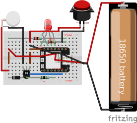

# Overview

#### The device has 4 modes: active, normal checks, slow checks, and off.
- After connecting to a network and MQTT, it starts in normal mode and wakes up every 15 seconds to check for commands.
- After reading a command, it will become active and stay awake for 2 minutes. It can recieve messages instantly in this mode.
- After 2 days of inactivity, the device enteres slow mode, and only checks every 30 seconds. (these values can be changed in the config)
- After sending the command `off`, the device will go into deep sleep, and can only be woken up with the button.

#### The LED has 6 colors.
- Red: Connecting to WiFi
- Blue: Connecting to MQTT
- Green: Active
- Yellow: Both devices are active
- White: This device is vibrating
- Magenta: Other device is vibrating
- Cyan: Sending vibrate command, other device should wake up soon

#### WiFi
The ESP32 communicates over WiFi using MQTT. It has a hardcoded default WiFi network. It will automatically try to connect to this when it first starts up. You can add networks to the config via the serial terminal or an MQTT command. After connecting to a new network, the default network is changed to the new network. The device will try 2 times to connect to the last connected network. If these attempts both fail, it will try every other network saved in the config. If it connects to a new network, it will move that network to the front of the list and set the last connected network. It repeats this process 3 times, then it gives up and goes to sleep for 2x the slow check interval (60 seconds) before trying again. If the device can't connect to any network, it will need to be connected to a computer with [Arudino IDE](https://www.arduino.cc/en/software/) to send a command to add a network.

#### MQTT
The LED displays the device's status while it's trying to connect to the MQTT server (and can't send any messages). It will shine red while connecting to WiFi, and shine blue while connecting to MQTT. After failing an MQTT connection 2 times, the device will go sleep for 2x the slow check interval (60 seconds) before trying again. Pushing the button will make it attempt a connection again.

#### Button
While connected, the button will trigger the other device's motor at 20% strength (can be changed). If the button is held for longer than 10 seconds the motor will automatically turn off.

#### Battery
The battery can be recharged by plugging in the device, and the voltage can be seen in the MQTT info topic. It's estimated the battery life would last 20 days with 1 hour of active time and 23 hours of normal checks a day. It's also estimated the battery is about to die at 3.3 volts.

# Sending Commands:
Commands can be sent to the device through the `Iot MQTT Panel` app. You can also see the status of each device, and they will display messages about their mode, when they vibrate, and current voltage. 

- the dashboard settings require a name (anything)
- an ID (anything)
- a broker address: `lc600a99.ala.us-east-1.emqxsl.com`
- a port: `8883`
- network protocol: TCP-SSL
- and in additional options, a username: `a`
- and a password: `a`
  
After connecting, add 5 panels. The available topics are `ESP32_1`, `ESP32_2`, and `info`. add a text input and output for ESP32_1 and ESP32_2, and a text output for info. 

# Commands
open the IoT MQTT Panel app on iOS or android to send commands through MQTT, or send commands in serial monitor in Arudino IDE

`run` - toggles the motor on

`run 100` - toggles the motor with 100% strength

`stop` - toggles the motor off

`print config` - prints config to the terminal

`config [key] [value]`, example: `config strength 100` - changes value of the entry in the config

`delete config` - deletes the config and recreates it with default values

`add network [name] [password]` - adds a network with the name/ssid and password

`delete network [ssid]` - deletes the WiFi network entry with the listed name/ssid

`print voltage` - prints voltage to the terminal and info topic MQTT

`sleep` - puts device to sleep, will wake up after normal check time

`off` - puts device to sleep, can only be woken with the button WIP

`var all` - prints the value of global variables, for debugging

You may need to wait to send a command if the device is trying to connect to MQTT.

# MQTT Broker Setup
If you don't want self host your MQTT broker, I recommend the service [EMQX](https://www.emqx.com/en/MQTT/public-MQTT5-broker). The free tier allows 1,000 devices to be connected, with 1,000,000 active minutes and 1 GB of data per month. This should be way more than enough for this project. Just make an account, make a project, set a username and password in `Access Control->Authorization`, and you can access the MQTT host in `Deployment Overview`. 

# Construction Notes
- To build this project, you can reference the item list below and `LDP-Wiring.svg` file in this repository. There is also a 3D model file `LDP-housing-model.stl` that can be printed to house the project once constructed.
- [info about the ESP32 xiao c3.](https://wiki.seeedstudio.com/XIAO_ESP32C3_Getting_Started/)
- The LED can't use pins D9 (GPIO21) or D7 (GPIO20) because they can't be turned off while asleep, and will cause the LED to dimly glow. 
- There is tape on the LED to prevent the pins from touching. This isn't strictly necessary, and anything to stop the pins from touching will work. 
- ESP32 battery wires should all be lead out of the back, away from the usb port. there should be 2 pairs of wires on the BAT-/BAT+ pads, 1 pair connected to the battery holder, and 1 pair of jumper cables to power the board. (If you solder another pair of 220k resistors on the pads, you don't need to attach the 220k resistors as shown in the picture [as described here](https://wiki.seeedstudio.com/XIAO_ESP32C3_Getting_Started/#check-the-battery-voltage).)
  


# Wiring Pictures


Unfortunately I made 2 mistakes in my soldering in these examples. You should refer to the fritzing model instead. The blue and purple wires are unnecessary, you only need 1 pair of jumper cables attached to the BAT+/BAT- pads on the ESP32. The header pins are also crooked on my ESP32 in this example. 


# To-do
- add finished housing picture
- upload finished 3d model
- edit code so it doesnt contain my netowrks and host etc
- what if WiFi goes out at home? once connected, ping first before going to MQTT


# Item list
[seeed ESP32 xiao c3](https://www.amazon.com/dp/B0DGX3LSC7/?coliid=I2IC5EZRWAHNOI&colid=PV7PKK8FXEMM&psc=1&ref_=list_c_wl_lv_ov_lig_dp_it)

[8000-16000RPM Motor](https://www.amazon.com/dp/B07KYLZC1S/?coliid=I126MR9PDJDCQ6&colid=PV7PKK8FXEMM&psc=0&ref_=list_c_wl_lv_ov_lig_dp_it)

[2 inch arcade buttons](https://www.amazon.com/dp/B07V55YPP3/?coliid=IDG3NBFSIP9FQ&colid=PV7PKK8FXEMM&psc=0&ref_=list_c_wl_lv_ov_lig_dp_it)

[1￵8￵6￵5￵0 Rechargeable Batter￵y](https://www.amazon.com/dp/B0DF6CPJFR/?coliid=I2VGGUA3UJVIOO&colid=PV7PKK8FXEMM&psc=1&ref_=list_c_wl_lv_ov_lig_dp_it)

[18650 Battery Holders](https://www.amazon.com/dp/B0BJV7SK5D/?coliid=I313229R87YLUP&colid=PV7PKK8FXEMM&psc=1&ref_=list_c_wl_lv_ov_lig_dp_it)

[Common Cathode RGB LEDs](https://www.amazon.com/dp/B077XGF3YR/?coliid=I13QFMGDXI117R&colid=PV7PKK8FXEMM&psc=1&ref_=list_c_wl_lv_ov_lig_dp_it)

[mini bread boards](https://www.amazon.com/dp/B09YXQJMTG/?coliid=I2YQE37EN4FBCN&colid=PV7PKK8FXEMM&psc=1&ref_=list_c_wl_lv_ov_lig_dp_it)

[Heat Resistant Polyimide Tape](https://www.amazon.com/dp/B0DZCTB4KG?ref=ppx_yo2ov_dt_b_fed_asin_title&th=1)

[2n2222 transistors](https://www.amazon.com/dp/B07T61SY9Y/?coliid=I3PYCMWC9PFVFN&colid=PV7PKK8FXEMM&psc=1&ref_=list_c_wl_lv_ov_lig_dp_it)

[diode](https://www.amazon.com/dp/B0FC2CTBJR/?coliid=I1ROCEWO08S2PZ&colid=PV7PKK8FXEMM&psc=1&ref_=list_c_wl_lv_ov_lig_dp_it)

[Breadboard Jumper Wire kit](https://a.co/d/aZJ2nzj)

[resistors](https://www.amazon.com/dp/B0F4P352BB/?coliid=I1F8ZJCRO5PW9O&colid=PV7PKK8FXEMM&psc=1&ref_=list_c_wl_lv_ov_lig_dp_it)

[header pins](https://www.amazon.com/dp/B07PKKY8BX/?coliid=INKQMG3MK3TDR&colid=PV7PKK8FXEMM&psc=1&ref_=list_c_wl_lv_ov_lig_dp_it)

# (WIP) Handling Blocked Public Networks
This is an overview to remind myself, this solution is not implemented in the code yet. On some public WiFi networks, the host `emqxsl.com` is blocked, and you will not be able to send any MQTT messages over the network. This is the case on my university's campus WiFi. You can bypass this by hosting a web service that receives the commands and sends them to EMQX. To do this,  I recommend the service [Render.com](https://render.com/). 
- Clone this github repository
- Go to `Projects`
- `Deploy A Web Service`
- Select this repository
- Set `Language` to `Node`
- Set `Root Directory` as `./Optional-MQTT-Bridge`
- Set `Build Command` to `npm install`
- Set `Start Command` to `npm start`

You can now use the web service link `https://example.onrender.com`  to send messages to your MQTT broker. You can send messages using the ESP32 like this:
```
http.begin(client, "https://example.onrender.com/publish");
http.addHeader("Content-Type", "application/json");
http.POST("{\"topic\":\"example_topic\",\"message\":\"hello\"}");
```

Or the command line like this:

`curl -X POST https://long-distance-plushie.onrender.com/publish -H "Content-Type: application/json" -d '{"topic": "example_topic", "message": "hello"}'`

However, there's also a login capture page when sending requests over HTTPS on my university's network. I don't know of a way to navigate the login portal on the ESP32, so one way to bypass this is MAC address spoofing. You can change your computer's MAC address, authenticate the WiFi network, set your ESP32's MAC address to match, then change your computer's MAC address back. There can't be 2 devices with the same MAC address on the same network. I could add a flag to the code to switch to always using the bridge, as well as a variable to store a MAC address. I don't plan on implementing this currently and will test out using a hotspot instead.

