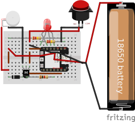

# Commands
open the IoT MQTT Panel app or sendMqtt.py to send commands through mqtt, or send commands in serial monitor in arudino ide

`run` - toggles the motor on

`run 100` - toggles the motor with 100% strength

`stop` - toggles the motor off

`print config` - prints config to the terminal

`config [key] [value]`, example: `config strength 100` - changes value of the entry in the config

`delete config` - deletes the config and recreates it with default values

`add network [name] [password]` - adds a network with the name/ssid and password

`delete network [ssid]` - deletes the wifi network entry with the listed name/ssid

`print voltage` - prints voltage to the terminal and info topic mqtt

`sleep` - puts device to sleep, will wake up after normal check time

`off` - puts device to sleep, can only be woken with the button WIP

`var all` - prints the value of global variables, for debugging

you may need to wait to send a command if it's trying to connect to mqtt

# Logic
the esp32 communicates over wifi using mqtt. it has a hardcoded default wifi network. it will automatically try to connect to this one every time it wakes up. you can add networks to the config via the serial terminal or an mqtt command, and it will check those networks if the default one fails after 5 seconds. after connecting to a new network, the default network is changed to the new network. the new default network will persist sleep cycles but not after pressing the reset button, but the config will always persist. the battery can be recharged by plugging in the device, and the voltage can be seen in the mqtt info topic. after failing to connect to wifi or mqtt, it will turn off indefinitely, and can be woken up by pressing the button. it's estimated the battery life would last 20 days with 1 hour of active time and 23 hours of normal checks a day. it's also estimated the battery is about to die at 3.3 volts. if there are no networks in the config and it can't connect to the default network, it will need to be connected to a computer with arudino ide to send a command to add a network.

#### the device has 4 modes: active, normal checks, slow checks, and off.
- after connecting to a network and mqtt, it starts in normal mode and wakes up every 15 seconds to check for commands.
- after reading a command, it will become active and stay awake for 1 minute. it can recieve messages instantly in this mode.
- after 2 days of inactivity, the device enteres slow mode, and only checks every 30 seconds. (these values can be changed in the config)
- after sending the command `off`, the device will go into deep sleep until woken up with the button.

the led displays the device's status while it's trying to connect to the mqtt server (and can't send any messages). it will blink red while connecting to wifi, and blink blue while connecting to mqtt. after 5 retries of 5 seconds each, the device will go into deep sleep and the led will turn off. pushing the button will make it attempt to connect again.

while connected, the button will trigger the other devices motor with the default strength. the motor is in a plastic case and will click when activated. the led will light up white when triggered. if the button is held for longer than 10 seconds the motor will automatically turn off and wait until the button is re-pressed.

commands can be sent to the device through the `Iot MQTT Panel` app. you can also see the status of each device, and they will display messages about their mode, when they vibrate, and estimated battery life left. 

# connecting to MQTT:
- the dashboard settings require a name (anything)
- an ID (anything)
- a broker address: `lc600a99.ala.us-east-1.emqxsl.com`
- a port: `8883`
- network protocol: TCP-SSL
- and in additional options, a username: `a`
- and a password: `a`
  
after connecting, add 5 panels. the available topics are `esp32_1`, `esp32_2`, and `info`. add a text input and output for esp32_1 and esp32_2, and a text output for info. 

# Wiring Pictures

Unfortunately I made 2 mistakes in my soldering in these examples. You should refer to the fritzing model instead. The blue and purple wires are unnecessary, you only need 1 pair of jumper cables attached to the BAT+/BAT- pads on the esp32. The header pins are also crooked on my esp32 in this example. 

# Construction Notes
- The LED can't use pins D9 (GPIO21) or D7 (GPIO20) because they can't be turned off while asleep, and will cause the LED to dimly glow. [info about the esp32 xiao c3](https://wiki.seeedstudio.com/XIAO_ESP32C3_Getting_Started/)
- There is tape on the LED to prevent the pins from touching. This isn't strictly necessary, and anything to stop the pins from touching will work. 
- Esp32 battery wires should all be lead out of the back, away from the usb port. there should be 2 pairs of wires on the BAT-/BAT+ pads, 1 pair connected to the battery holder, and 1 pair of jumper cables to power the board. (If you solder another pair of 220k resistors on the pads, you don't need to attach the 220k resistors as shown in the picture [as described here](https://wiki.seeedstudio.com/XIAO_ESP32C3_Getting_Started/#check-the-battery-voltage).)
  

# To-do
- check if off command works
- make sure efficiently connects when there are many wifi networks in config
- move to front heuristic for wifi networks
- after failing to connect, only try to connect to scanned networks that are also listed in config

- print more useful debug info to the info topic, when waking and sleeping
- design and 3d print housing
- what if wifi goes out at home? once connected, ping first before going to mqtt

# Item list
[seeed esp32 xiao c3](https://www.amazon.com/dp/B0DGX3LSC7/?coliid=I2IC5EZRWAHNOI&colid=PV7PKK8FXEMM&psc=1&ref_=list_c_wl_lv_ov_lig_dp_it)

[8000-16000RPM Motor](https://www.amazon.com/dp/B07KYLZC1S/?coliid=I126MR9PDJDCQ6&colid=PV7PKK8FXEMM&psc=0&ref_=list_c_wl_lv_ov_lig_dp_it)

[2 inch arcade buttons](https://www.amazon.com/dp/B07V55YPP3/?coliid=IDG3NBFSIP9FQ&colid=PV7PKK8FXEMM&psc=0&ref_=list_c_wl_lv_ov_lig_dp_it)

[1￵8￵6￵5￵0 Rechargeable Batter￵y](https://www.amazon.com/dp/B0DF6CPJFR/?coliid=I2VGGUA3UJVIOO&colid=PV7PKK8FXEMM&psc=1&ref_=list_c_wl_lv_ov_lig_dp_it)

[18650 Battery Holders](https://www.amazon.com/dp/B0BJV7SK5D/?coliid=I313229R87YLUP&colid=PV7PKK8FXEMM&psc=1&ref_=list_c_wl_lv_ov_lig_dp_it)

[Common Cathode RGB LEDs](https://www.amazon.com/dp/B077XGF3YR/?coliid=I13QFMGDXI117R&colid=PV7PKK8FXEMM&psc=1&ref_=list_c_wl_lv_ov_lig_dp_it)

[mini bread boards](https://www.amazon.com/dp/B09YXQJMTG/?coliid=I2YQE37EN4FBCN&colid=PV7PKK8FXEMM&psc=1&ref_=list_c_wl_lv_ov_lig_dp_it)

[Heat Resistant Polyimide Tape](https://www.amazon.com/dp/B0DZCTB4KG?ref=ppx_yo2ov_dt_b_fed_asin_title&th=1)

[2n2222 transistors](https://www.amazon.com/dp/B07T61SY9Y/?coliid=I3PYCMWC9PFVFN&colid=PV7PKK8FXEMM&psc=1&ref_=list_c_wl_lv_ov_lig_dp_it)

[diode](https://www.amazon.com/dp/B0FC2CTBJR/?coliid=I1ROCEWO08S2PZ&colid=PV7PKK8FXEMM&psc=1&ref_=list_c_wl_lv_ov_lig_dp_it)

[Breadboard Jumper Wire kit](https://a.co/d/aZJ2nzj)

[resistors](https://www.amazon.com/dp/B0F4P352BB/?coliid=I1F8ZJCRO5PW9O&colid=PV7PKK8FXEMM&psc=1&ref_=list_c_wl_lv_ov_lig_dp_it)

[header pins](https://www.amazon.com/dp/B07PKKY8BX/?coliid=INKQMG3MK3TDR&colid=PV7PKK8FXEMM&psc=1&ref_=list_c_wl_lv_ov_lig_dp_it)

